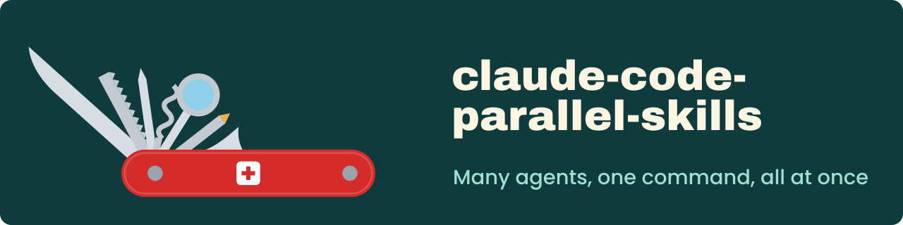

<p align="center">
  
</p>

# Claude Code Parallel Skills

Reusable workflows for [Claude Code](https://docs.anthropic.com/en/docs/claude-code). Parallel commands spawn many specialized agents at once to review, research, investigate and implement. Durable loops keep their progress in files, resume across sessions and stop on recorded evidence.

## Features

- `/investigate!`: root-cause analysis with 7+ parallel agents, then a fix with a reproduction test.
- `/review-pr!`: 7+ simultaneous reviewers, synthesized into a severity-ranked APPROVE / REQUEST CHANGES / NEEDS DISCUSSION verdict.
- `/review-code!`: whole-codebase audit through 7+ orthogonal lenses, ending in a scored health report.
- `/research!`: 7+ researchers attack a question from different angles and return options and trade-offs.
- `/implement!`: contracts first, then N executor agents on non-overlapping files, then parallel verification.
- `/coderabbit-loop`: a bounded [CodeRabbit](https://coderabbit.ai) review-and-fix loop that stops at `READY` by default.
- `/goal-loop`, `/refine-loop`, `/docs-loop`: durable loops for a concrete goal, behavior-preserving polish, and docs drift across many repos.
- Uses [oh-my-claudecode](https://github.com/Yeachan-Heo/oh-my-claudecode) (OMC) specialists when available; the loops need OMC only for unattended continuation.

## Quick start

```bash
mkdir -p ~/.claude/commands ~/.claude/skills
cp skills/*.md ~/.claude/commands/
cp -R loops/goal-loop loops/refine-loop loops/docs-loop ~/.claude/skills/
```

Then run a command in Claude Code, for example `/review-pr!`. Per-project install and more examples are in [Installation and usage](docs/installation.md).

## Documentation

- [Parallel commands](docs/commands.md): `/investigate!`, `/review-pr!`, `/review-code!`, `/research!`, `/implement!`, `/coderabbit-loop`
- [Autonomous loops](docs/loops.md): `/goal-loop`, `/refine-loop`, `/docs-loop`
- [Installation and usage](docs/installation.md): install paths, examples, requirements
- [Design](docs/design.md): philosophy, principles and references

## License

[GPL-3.0](LICENSE)
